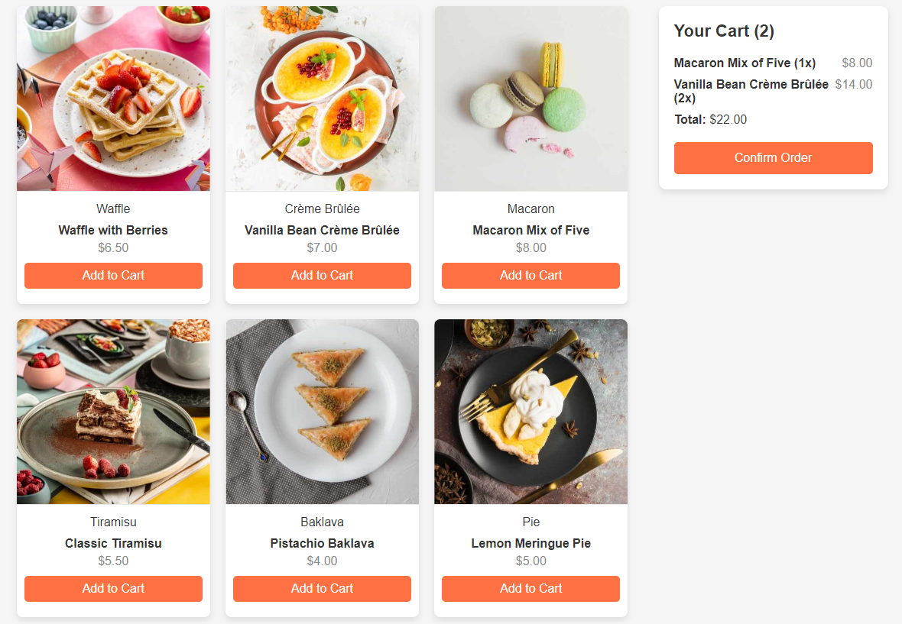

# README

## Descrição do Projeto

Este projeto é uma aplicação web de lista de produtos com um carrinho de compras. Ele permite que os usuários visualizem produtos, adicionem itens ao carrinho e confirmem pedidos. A interface é responsiva e utiliza uma abordagem moderna de design.

## Screenshot do Projeto

## Tecnologias Utilizadas

- **HTML**: Estrutura básica da aplicação.
- **CSS**: Estilos para a interface do usuário.
- **TypeScript**: Lógica de negócios, incluindo manipulação do carrinho de compras.
- **Vite**: Ferramenta de construção para desenvolvimento e otimização do projeto.

## Estrutura do Projeto

O projeto contém os seguintes arquivos principais:

- `index.html`: Página principal da aplicação.
- `styles.css`: Estilos CSS para a interface.
- `app.ts`: Lógica em TypeScript para gerenciar o carrinho e a lista de produtos.
- `data.json`: Arquivo com dados dos produtos.

### Principais Componentes

- **Layout Flexbox e Grid**: Usado para estruturar a lista de produtos e o carrinho.
- **Classe `ShoppingCart`**: Gerencia os itens do carrinho e calcula o total.
- **Manipulação de DOM**: Atualiza a interface com os produtos e o carrinho em tempo real.

## Requisitos

Para executar este projeto, você precisará ter o **Node.js** e o **Vite** instalados.